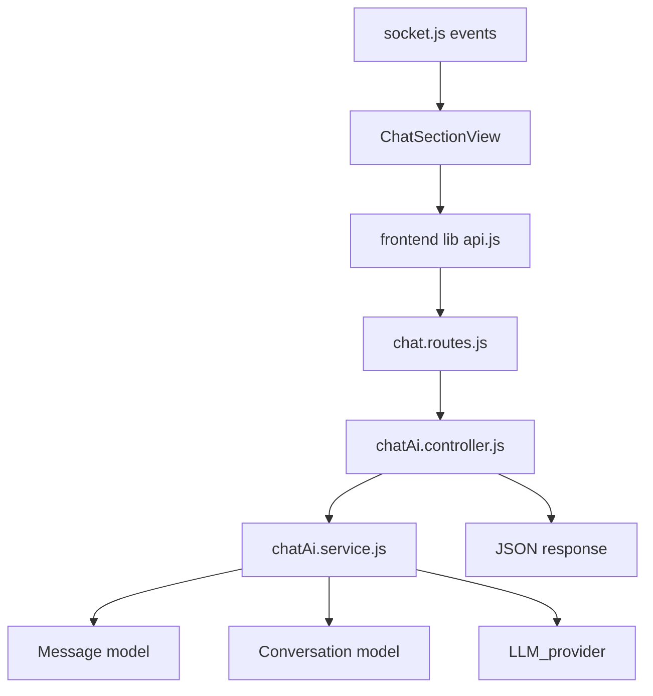

# Thiết kế tích hợp AI cho ChatApp (Mixi)

Tài liệu này mô tả **thiết kế** (không phải code) để tích hợp AI vào chat với 2 tính năng chính:

1. **Tóm tắt tin nhắn chưa đọc** (Unread summary) — kiểu “Meta summary”.
2. **Gợi ý câu trả lời** (Reply suggestions) — học “tone/cách nhắn” của chính user trong **cùng conversation**.

Rule thực thi cho AI/agent khi code: [`.cursor/rules/ai-integration-chatapp.mdc`](../.cursor/rules/ai-integration-chatapp.mdc)

---

## 1) Hiện trạng hệ thống chat (để bám đúng kiến trúc)

### Backend

- Router: [`backend/src/routes/chat.routes.js`](../backend/src/routes/chat.routes.js)
- Controller: [`backend/src/controllers/chat.controller.js`](../backend/src/controllers/chat.controller.js) (handlers: `getConversationsHandler`, `getMessagesHandler`, `sendMessageHandler`, …)
- Service: [`backend/src/services/chat.service.js`](../backend/src/services/chat.service.js)
- Models: [`backend/src/models/Conversation.js`](../backend/src/models/Conversation.js), [`backend/src/models/Message.js`](../backend/src/models/Message.js)
- Realtime: [`backend/src/socket.js`](../backend/src/socket.js) (emit events từ controller)

Luồng chính hiện có:

- **Danh sách conversation**: `GET /chat/conversations` → `listConversations`
- **Tải tin nhắn**: `GET /chat/conversations/:conversationId/messages` → `listMessages` (có pagination `before`, trả `pageInfo.hasMore/nextBefore`)
- **Đánh dấu đã đọc (explicit)**: `PATCH /chat/conversations/:conversationId/read` → `markConversationRead` (emit `chat:conversation_read`)
- **Gửi tin**: `POST /chat/conversations/:conversationId/messages` → `sendMessage` (update `Conversation.lastMessage*`, `unreadCounts`, emit `chat:message_created`)

### Frontend

- Sidebar: [`frontend/src/components/chat-comp/ChatSidebarSecondaryPanel.jsx`](../frontend/src/components/chat-comp/ChatSidebarSecondaryPanel.jsx)
- Khung chat: [`frontend/src/components/chat-comp/ChatSectionView.jsx`](../frontend/src/components/chat-comp/ChatSectionView.jsx)
- API client: [`frontend/src/lib/api.js`](../frontend/src/lib/api.js)

Ghi chú UX hiện có liên quan “unread / read”:

- **Quan trọng (đối chiếu code hiện tại)**: `listMessages` **luôn** gọi `markConversationRead` trước khi trả messages → `unreadCounts` của viewer về **0** ngay khi client fetch messages.
  - Hệ quả: nếu UI load messages trước, “unread summary theo unreadCounts” sẽ **mất ngữ cảnh unread** trừ khi:
    - client gọi endpoint AI **trước** khi fetch messages, hoặc
    - tách `markConversationRead` khỏi `listMessages` (thay đổi behavior), hoặc
    - lưu `lastReadMessageId/lastReadAt` để định nghĩa unread độc lập với counter sidebar.

---

## 2) Mục tiêu sản phẩm

### UC-A — AI Summary (Unread)

- Người dùng thấy nút/chip kiểu: `Summarize unread` khi đủ điều kiện.
- AI trả về tóm tắt ngắn các nội dung quan trọng trong vùng unread.

**Điều kiện đề xuất (đã thống nhất trước đó, có thể chỉnh):**

- `unreadCount >= 10`
- Trong unread có **ít nhất 5** message text (không tính ảnh/sticker — ảnh chỉ là `[image]`)

> Lưu ý: điều kiện unread phụ thuộc định nghĩa “read receipt” của app. Phần 7 nêu các lựa chọn cần bạn chốt.

### UC-B — AI Suggested Replies

- Khi user đang chat trong thread, hệ thống gợi ý **3** câu trả lời ngắn.
- Gợi ý phải:
  - phù hợp ngữ cảnh tin nhắn gần nhất từ đối phương (hoặc thread gần đây),
  - bám “phong cách” của chính user **trong conversation đó** (corpus các message do user gửi).

---

## 3) Nguyên tắc thiết kế kỹ thuật

- **LLM chỉ gọi ở backend** (service layer), không từ browser.
- Tách service: `chatAi.service.js` (đề xuất) để không làm phình `chat.service.js`.
- Mọi endpoint AI đều:
  - `requireAuth`
  - verify `req.user.id` là participant của `conversationId`
  - chỉ query message trong conversation đó
- **Client không gửi transcript** để tránh bypass quyền; server tự query DB.

---

## 4) Kiến trúc đề xuất



Gợi ý tổ chức file (khi implement):

- `backend/src/services/chatAi.service.js`
- `backend/src/controllers/chatAi.controller.js`
- Gắn route vào `backend/src/routes/chat.routes.js` *(hoặc)* tách `ai.routes.js` rồi mount dưới `/api/chat` — ưu tiên **ít thay đổi** thì gắn cùng `chat.routes.js`.

---

## 5) Context pack (dữ liệu đưa vào LLM)

Server build 2 phần:

### 5.1 Transcript window (cho summary và/hoặc reply)

- Lấy message trong `conversationId`, sort theo thời gian.
- Filter:
  - `deletedAt == null`
  - ưu tiên `type=text` cho đếm “text unread”
  - `image` → thay bằng `[image]` trong prompt

### 5.2 Style corpus (chỉ message của viewer)

- Lấy N message gần nhất có `senderId == viewerUserId` và `type=text`.
- N đề xuất: 15–40 (tuỳ token budget).

### 5.3 “Unread boundary”

Cần một mốc để xác định unread slice:

- **Option 1 (đơn giản)**: dùng `Conversation.unreadCounts.get(viewerId)` + query last K messages rồi cắt theo heuristic (kém chính xác nếu unreadCounts không khớp timeline).
- **Option 2 (khuyến nghị)**: lưu `lastReadMessageId` / `lastReadAt` per user per conversation (có thể là field trong `Conversation` hoặc collection `conversation_members` ở tương lai).
- **Option 3 (tạm thời)**: summary theo “50 tin gần nhất chưa đọc theo client snapshot” — không khuyến nghị vì dễ sai bảo mật.

---

## 6) Prompt/output chuẩn

### Summary prompt (ý chính)

- Input: unread transcript đã sanitize.
- Output: 3–6 bullet, tiếng Việt (hoặc auto detect — nhưng nên chốt policy).
- Ràng buộc: không suy diễn không có trong transcript.

### Suggested replies prompt (ý chính)

- Input:
  - đoạn hội thoại gần đây (ví dụ 20–30 tin)
  - style corpus của viewer
  - “last inbound message” (tin nhắn mới nhất không phải của viewer)
- Output JSON:

```json
{ "replies": ["...", "...", "..."] }
```

---

## 7) API contract (đề xuất)

> Prefix thực tế của app là `/api/chat/...` (theo convention dự án). Dưới đây là path relative trong router chat.

### 7.1 Summarize unread

`POST /chat/conversations/:conversationId/ai/summarize-unread`

Body (optional):

```json
{
  "maxMessages": 50,
  "language": "auto"
}
```

Response 200:

```json
{
  "success": true,
  "summary": "- ...\n- ...",
  "cached": true,
  "meta": {
    "source": "cache",
    "model": "gpt-x",
    "generatedAt": "2026-05-04T00:00:00.000Z"
  }
}
```

Response lỗi:

- `403` không phải participant
- `404` conversation không tồn tại
- `400` không đủ điều kiện unread/text
- `429` rate limit
- `500` lỗi LLM/timeout

### 7.2 Suggest replies

`POST /chat/conversations/:conversationId/ai/suggest-replies`

Body (optional):

```json
{
  "recentLimit": 30,
  "styleLimit": 30,
  "language": "auto"
}
```

Response 200:

```json
{
  "success": true,
  "replies": ["...", "...", "..."],
  "cached": false,
  "meta": {
    "basedOnMessageId": "...",
    "generatedAt": "2026-05-04T00:00:00.000Z"
  }
}
```

---

## 8) DB / schema đề xuất

### 8.1 Tối thiểu (khuyến nghị để ship nhanh)

Thêm field vào `Conversation` (hoặc subdocument) để cache theo **viewer** — vì summary/suggestions là trải nghiệm cá nhân hoá.

Vì `Conversation` hiện là document chung, có 2 hướng:

- **Hướng A (đơn giản)**: `aiAssistByUser` kiểu `Map<userId, object>` trong `Conversation`
- **Hướng B (sạch hơn)**: collection mới `ChatAiState`

**Khuyến nghị MVP**: Hướng B (tránh phình document conversation).

Schema đề xuất `ChatAiState`:

- `conversationId`
- `userId` (viewer)
- `summaryText`, `summaryUpdatedAt`, `summaryCursorMessageId` (hoặc `summaryUpToCreatedAt`)
- `suggestedReplies[] (string)`, `suggestionsUpdatedAt`, `suggestionsBasedOnMessageId`
- `version` (prompt/model version)

### 8.2 Field liên quan read receipt (nếu làm đúng unread)

Tuỳ chọn (nên có nếu bạn muốn summary unread chính xác):

- `lastReadMessageId` per user per conversation

---

## 9) Cache, invalidate, rate limit

### Invalidate summary

- Khi có message mới với `createdAt` sau `summaryCursor` đã dùng.
- Khi user bấm “Regenerate”.

### Invalidate suggestions

- Khi có inbound message mới (đối phương gửi) sau `suggestionsBasedOnMessageId`.
- Khi user gửi message (tuỳ UX: có thể giữ suggestions đến khi inbound mới).

### Rate limit (đề xuất)

- `summarize`: tối đa 3 lần / 10 phút / user / conversation
- `suggest-replies`: tối đa 10 lần / 10 phút / user / conversation

---

## 10) UX đề xuất (giữ UI hiện tại, thêm lớp AI)

- **Summary**: chip/button trong header thread hoặc banner phía trên `MessageList` khi đủ điều kiện.
- **Suggestions**: panel nhỏ phía trên `MessageInput` với 3 chip; click để điền vào input (không auto gửi).
- Trạng thái:
  - loading nhẹ theo từng feature (không làm mờ cả màn hình).

---

## 11) Lộ trình triển khai theo phase

### Phase 0 — Chốt product rules

- Chốt định nghĩa unread/read (ảnh hưởng trực tiếp summary).

### Phase 1 — Backend MVP

- `chatAi.service.js` + 2 endpoint POST
- Query transcript + style corpus + gọi LLM + lưu `ChatAiState`

### Phase 2 — Frontend MVP

- Thêm API vào `frontend/src/lib/api.js`
- Hook `useChatAi` + UI chips

### Phase 3 — Tối ưu

- Prefetch suggestions khi inbound socket event
- Structured output + eval nội bộ (golden prompts)

---

## 12) Ghi chú review — các điểm cần bạn chốt trước khi code

1. **Unread/read + thứ tự API**: hiện `GET /chat/conversations/:id/messages` **auto mark read**. Bạn chọn hướng nào?
   - **A)** Giữ nguyên: UI phải gọi `POST .../ai/summarize-unread` **trước** `getMessages` khi user bấm summary.
   - **B)** Đổi behavior: bỏ auto-read khỏi `listMessages`, chỉ read khi `PATCH .../read` (breaking change cho client hiện tại nếu không cập nhật đồng bộ).
   - **C)** Thêm read-receipt chính xác (`lastReadMessageId`) để unread/summary không phụ thuộc counter.
2. **Ngôn ngữ output**: cố định Tiếng Việt hay auto theo transcript?
3. **Suggestions trigger**: chỉ khi có inbound mới, hay mỗi lần user focus input?
4. **Lưu cache**: trong `Conversation` Map hay collection `ChatAiState` riêng?
5. **Model provider**: OpenAI/Azure/self-host — ảnh hưởng env vars và cost guardrails.
6. **Giới hạn dữ liệu AI**: `maxMessages`, độ dài text tối đa mỗi message (hiện server giới hạn 4000), có summarize cả `[image]` token hay bỏ qua?
